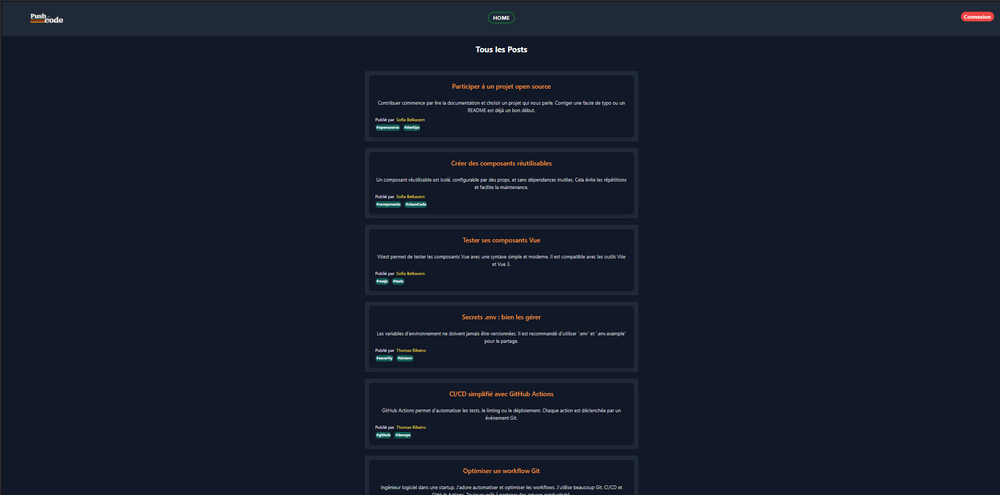
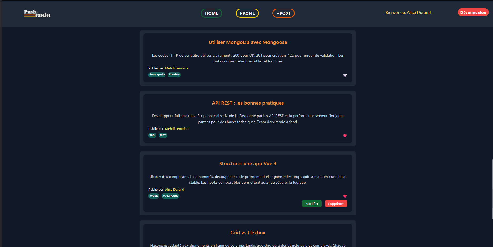
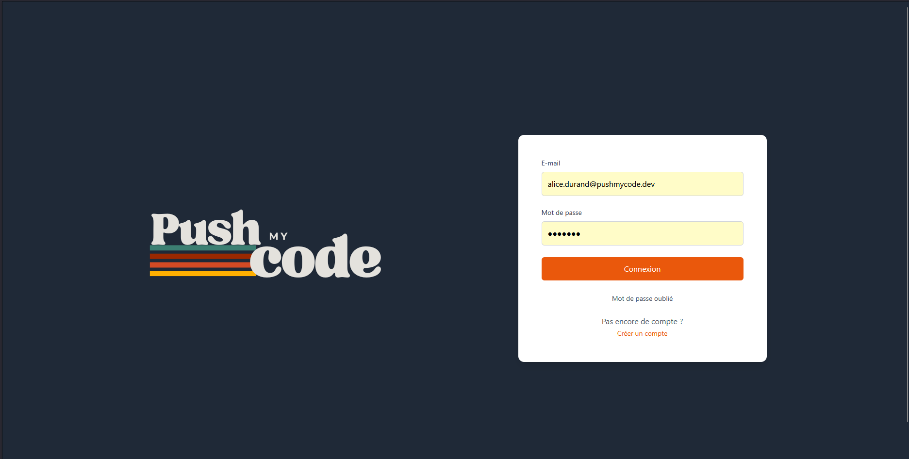
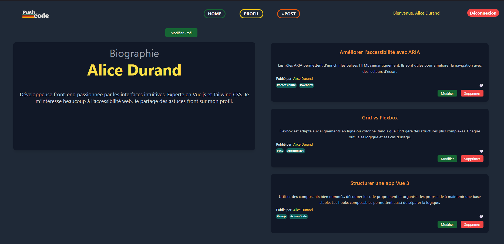
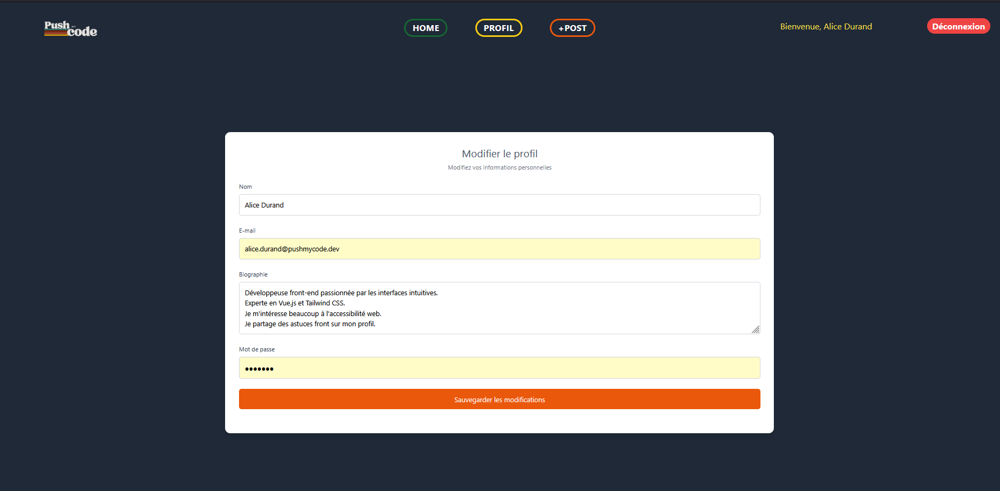
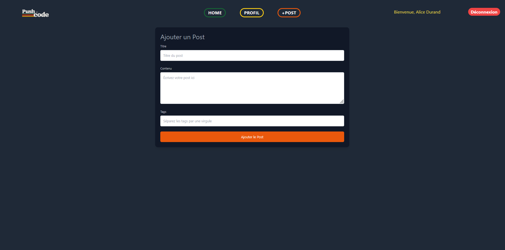
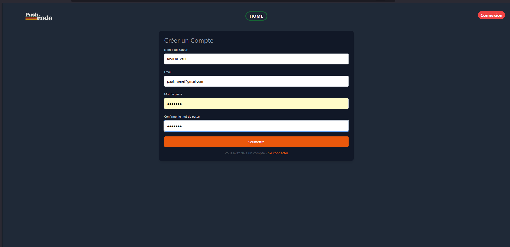

# Push My Code

<p align="center">
  
</p>

## 📌 Présentation

Push My Code est une application de microblogging permettant aux utilisateurs de publier de courts messages (posts), de les liker, et de gérer leur profil utilisateur. Ce projet a été développé dans le cadre d'une formation en développement full stack.

L'objectif est de simuler un mini réseau social avec une architecture moderne en front-end et back-end, reposant sur Vue.js, Laravel et une base de données PostgreSQL.

## 📸 Screenshots du projet

<div style="display: flex; justify-content: space-around;">













</div>

## 🛠️ Technologies utilisées

### Front-end :
- Vue.js 3
- Vue Router
- Axios
- Tailwind CSS
- Vite

### Back-end :
- Laravel 10
- Laravel Sanctum (authentification)
- PostgreSQL

## 🚀 Lancement du projet

### 1. Cloner le projet
```bash
git clone https://github.com/Evan69007/Microblogging.git
cd push-my-code
```

### 2. Configuration du back-end Laravel
```bash
cd microblogging_app
cp .env.example .env
composer install
php artisan key:generate
php artisan migrate --seed
php artisan serve
```

> Assurez-vous que PostgreSQL est installé et configuré. Renseignez les identifiants de connexion dans le fichier `.env`.

### 3. Lancer le front-end Vue.js
```bash
cd ../microblogging_front
npm install
npm run dev
```

## ✨ Fonctionnalités

- 📝 Création et affichage de posts
- ❤️ Like/unlike de posts
- 👤 Connexion et inscription
- 🔐 Authentification sécurisée via Laravel Sanctum
- ✏️ Modification du profil utilisateur
- 🗑️ Suppression de posts
  
## 👩‍💻 Auteurs

- **Mariama DAFF** – Développeuse full stack (Projet personnel dans le cadre de la formation ADA Tech School)
- **Evan Aguttes-Rivelon** – Développeur full stack (Projet personnel dans le cadre de la formation ADA Tech School)
- **Vincent Bourgin** – Développeur full stack (Projet personnel dans le cadre de la formation ADA Tech School)
- **Élodie Sorce** – Développeuse full stack (Projet personnel dans le cadre de la formation ADA Tech School)
